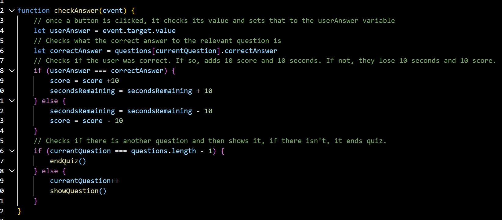

# Code-Quiz-Challenge

Aa a coding boot camp student I wanted to take a timed quiz on JavaScript fundamentals. It should store high scores so that I can gauge my progress compared to my peers.

## The Goal

The objective was to develop, in JavaScript, a quiz that could be taken by class mates.

The required parameters were:

    * The quiz started upon pressing the start button
    * There should be an active timer
    * Once a question is answered, the next question should appear
    * If a question is answered incorrectly, the timer should be reduced
    * The quiz ends, when either all the questions are answered, or when the timer reaches 0
    * The contestant should be able to save their scores and initials

The secondary objective was to ensure that the code would still function should more data be added, and that it was commented in a way which enables other developers to take over if required.

## Usage

To view the project, please follow the links below:

https://github.com/Bcott93/Code-Quiz-Challenge

### Credits:

- [w3schools]
- [Javascript tutorial]

### License

Please see the License in the Repo.
